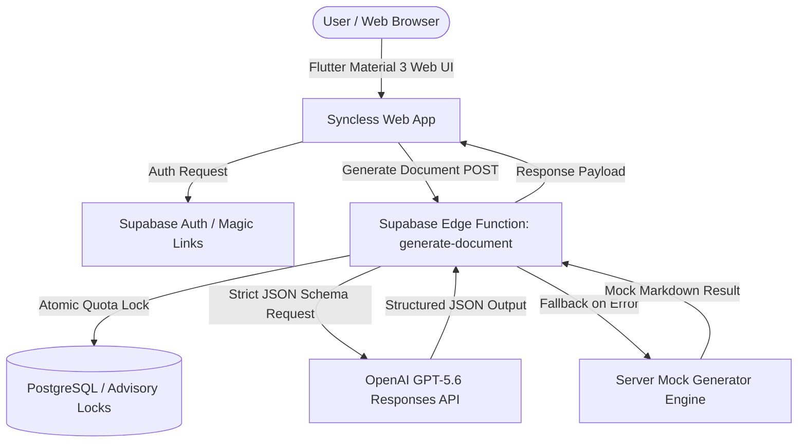

# Syncless ⚡

> **Turn Conversations into Execution.**
>
> Syncless is a high-performance AI document synthesis engine built for product managers, software engineers, and technical leaders. It transforms raw meeting transcripts, messy Slack threads, and unstructured notes into structured, executive-ready execution artifacts in seconds.

---

## 🌟 Key Features

- **Guest-First Workspace Sandbox**: Jump straight into the workspace to test preset examples, write notes, and select output modes without initial login blocks.
- **Multi-Document Generation Modes**:
  - **Work Specification**: Product scope, technical decisions, user flows, and acceptance criteria.
  - **Sprint Plan**: Story-point estimated developer ticket breakdowns ready for Jira or Linear copy-pasting.
  - **Executive Brief**: High-level summaries, business impact metrics, and strategic milestone roadmaps for leadership.
- **Dynamic Format Descriptors**: Live, interactive helper cards explain the purpose and output structure of each format mode as you select them.
- **Fullscreen Context Editor**: Dedicated 850x650 modal editor for viewing and refining multi-page transcripts with high-visibility typography (18px).
- **Animated Top Notification Toast**: Custom top-sliding banner notifications with spring-bounce animation physics (`Curves.easeOutBack`) and auto-dismissal.
- **Resilient Mock Fallback Engine**: If AI API endpoints encounter credit exhaustion or network failures during live presentations, a server-side fallback engine seamlessly serves topic-matched, high-fidelity mock documents to guarantee zero downtime.

---

## 🛠️ Architecture & Tech Stack



### Stack Breakdown

- **Frontend**: Flutter 3 (Web), Material 3 Dark First Theme, Riverpod 2 (Typed State Management).
- **Backend & Storage**: Supabase Edge Functions (Deno 2 runtime), PostgreSQL 15, Row Level Security (RLS).
- **AI Engine**: OpenAI GPT-5.6 Responses API using strict JSON Schema validation.

---

## 🔒 Security & Compliance Checklist

Syncless enforces security-by-design principles across all layers:

1. **Zero Client Secret Exposure**:
   - `OPENAI_API_KEY` and `SUPABASE_SERVICE_ROLE_KEY` reside exclusively within encrypted Supabase Server Secrets.
   - Flutter web builds only hold the public `SUPABASE_ANON_KEY`.
2. **Server-Authoritative Authorization**:
   - Every Edge Function invocation parses and validates the user's Supabase JWT session header.
3. **Race-Condition & Overspend Prevention**:
   - Quota enforcement uses `pg_advisory_xact_lock` transaction serialization in PostgreSQL, preventing double-click or concurrent tab exploits.
4. **Input Sanitization & Injection Defense**:
   - Source context is sanitized and validated against length bounds (`12,000` free limit, `100,000` pro limit).
   - SQL queries are executed exclusively via typed stored procedures with parameterized inputs.
5. **CSRF & Web Security**:
   - Cross-Origin Resource Sharing (CORS) is restricted to verified origins.
   - All communications are strictly HTTPS encrypted by default.

---

## 🚀 Getting Started

### 1. Prerequisites

- **Flutter SDK**: `>=3.19.0`
- **Deno / Supabase CLI**: Installed for Edge Function deployment
- **Supabase Account**: A linked Supabase project

### 2. Environment Setup

Create a `.env` file in the root directory:

```env
SUPABASE_URL=https://your-project-id.supabase.co
SUPABASE_ANON_KEY=your-supabase-anon-key
```

### 3. Database Migration

Apply the database schema, RLS policies, and stored procedures:

```bash
supabase link --project-ref your-project-id
supabase db push
```

### 4. Edge Function Secrets & Deployment

Set secrets on your Supabase project:

```bash
supabase secrets set OPENAI_API_KEY="sk-proj-your-key"
supabase secrets set SAFETY_IDENTIFIER_SALT="your-random-salt-string"
```

Deploy the `generate-document` Edge Function:

```bash
supabase functions deploy generate-document
```

### 5. Running the Web Application

Run the Flutter web app locally:

```bash
flutter run -d chrome --dart-define-from-file=.env
```

---

## 🧪 Verification & Static Analysis

Ensure 100% clean static analysis and compilation before deployment:

```bash
flutter analyze
```

\*Status: **0 Issues Found!\***

---

## 📄 License

Built for the **OpenAI Build Week Hackathon**. Distributed under the MIT License.

## 📧 Contact

- Email:[nishanajihah.dev@gmail.com]
